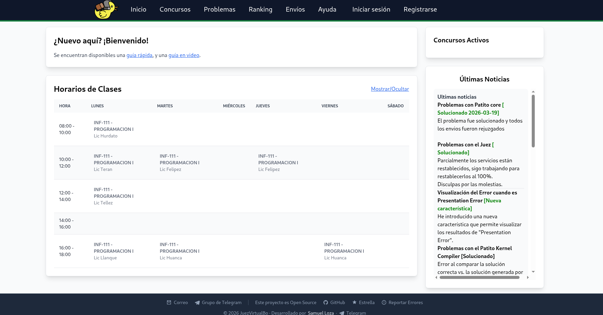
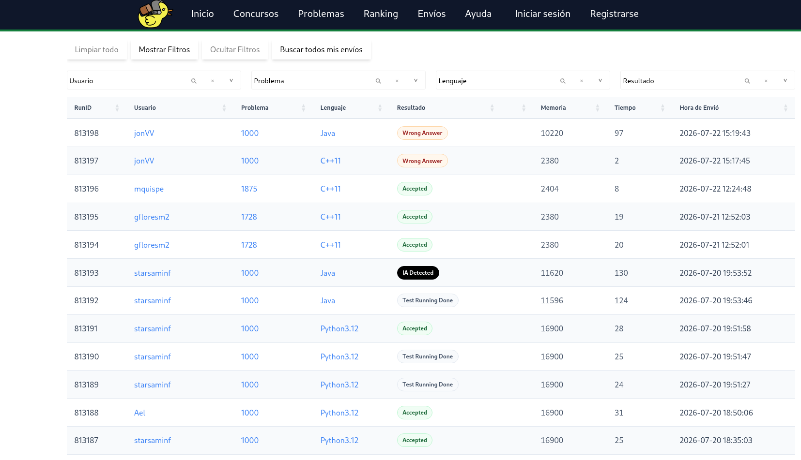
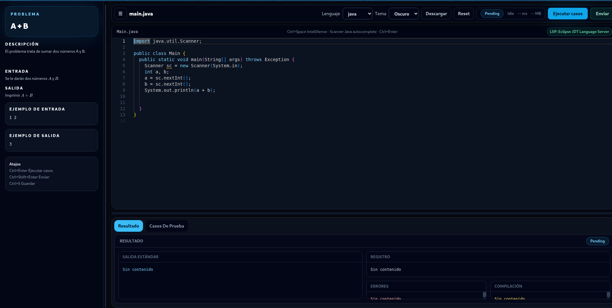
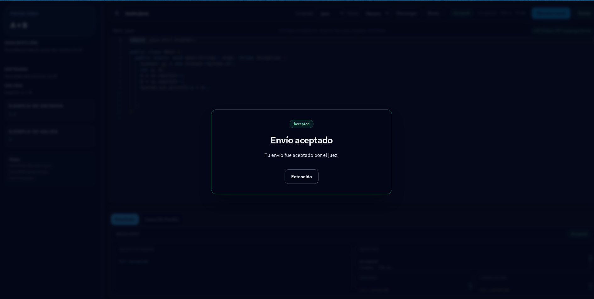
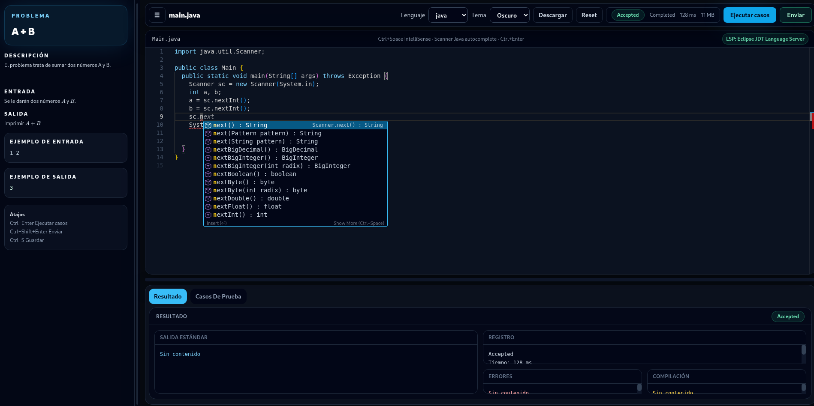

# Cliente web de Patito Online Judge

Esta es la web que usan los estudiantes: problemas, concursos, envíos, rankings, perfil e inicio de sesión. Está escrita en PHP.

## Inicio Rapido

```bash
docker compose -f docker/compose.yml up --build
```

Abre <http://localhost:8082/oj/>.

El contenedor usa `docker/.env.example`. Para montar otro archivo:

```bash
PATITO_STARTER_ENV_FILE=./mi-entorno.env \
  docker compose -f docker/compose.yml up --build
```

El ambiente de prueba trae estas cuentas:

| Rol | Usuario | Contraseña |
| --- | --- | --- |
| Estudiante | `patito` | `patito` |
| Administrador | `patitoAdmin` | `patitoAdmin` |

No uses esas cuentas fuera del entorno local.

## Dependencias

El entorno de `docker/compose.yml` levanta solamente esta web y su propia MariaDB de demostración. Sirve para trabajar en pantallas y flujos básicos.

Para probar la integración completa también hacen falta:

- `onlineJudgeAdmin-back` para las rutas nuevas de la API;
- `core` para procesar envíos;
- `patito-ide` para abrir el editor desde un problema;
- `patito-lsp-server` para el autocompletado del IDE.

```bash
docker compose up -d --build
```

La web queda en <http://localhost:8082/oj/>. Compose inicia primero `patito-db` y espera su healthcheck.

## Variables de entorno

La aplicación lee primero `.env.local` y después `.env`.

| Variable | Uso |
| --- | --- |
| `SITE_ID` | identificador del sitio actual |
| `APP_ENV` | ambiente, por ejemplo `development` o `production` |
| `APP_PREFIX_ROUTE` | prefijo de la web; normalmente `/oj` |
| `APP_DOMAIN` | URL pública del cliente |
| `APP_DOMAIN_ADMIN` | URL del panel administrativo |
| `APP_DOMAIN_API` | URL de la API |
| `THEME_TEMPLATE` | plantilla visual activa |
| `DB_HOST`, `DB_NAME` | servidor y nombre de MariaDB |
| `DB_USER`, `DB_PASS` | credenciales de MariaDB |
| `JWT_ISS`, `JWT_AUD` | emisor y audiencia compartidos con la API |
| `JWT_SECRET` | clave usada para firmar tokens |
| `VIBE_IDE_BASE_URL` | URL pública de Patito IDE |
| `VIBE_IDE_TOKEN_SECRET` | clave compartida para abrir el IDE |
| `VIBE_IDE_TOKEN_TTL_SECONDS` | duración del enlace al IDE |

Correo y Telegram son opcionales: `MAIL_USER_NAME`, `MAIL_PASSWORD`, `MAIL_SUBJECT`, `TELEGRAM_BOT_TOKEN` y `TELEGRAM_CHAT_ID` pueden quedar vacías si no se usan notificaciones.

Usa secretos distintos en desarrollo y producción.

## Plantillas

Las vistas están en `PatitoOnlineJudge/Presentation/Views/`. La plantilla se elige así:

```env
THEME_TEMPLATE=patito
```

Están disponibles `patito`, `itboliviamar`, `juezvirtual` y `jvbo`.

## Estructura del proyecto

```text
.
├── PatitoOnlineJudge/
│   ├── Config/              carga del entorno
│   ├── Core/
│   │   ├── Domain/          modelos y contratos
│   │   └── Application/     servicios
│   ├── Infrastructure/      repositorios e integraciones
│   └── Presentation/
│       ├── Controller/      controllers HTTP
│       ├── Middleware/      sesión y permisos
│       └── Views/           plantillas y módulos
├── Legacy/                  constantes y traducciones antiguas
├── public/
│   ├── Routing/             rutas
│   ├── assets/              CSS, JavaScript e imágenes
│   └── index.php            entrada de la web
├── docker/
│   ├── .env.example        entorno de demostración
│   └── compose.yml         servicios locales
├── docs/                    capturas e historia del proyecto
├── composer.json
└── README.md
```

Para trabajar sin Docker se necesita PHP, Composer y las extensiones de MariaDB:

```bash
composer install
composer dump-autoload
```

El document root del servidor debe apuntar a `public/`, no a la raíz del repositorio.

## Historia del proyecto

Patito comenzó en 2012 con pruebas de HUSTOJ para cursos y entrenamiento de programación competitiva en la UMSA. Desde entonces pasó por varias etapas de traducción, adaptación, despliegue y desarrollo propio.

La historia completa, las personas que participaron y la línea de tiempo están en [`docs/HISTORY.md`](docs/HISTORY.md).

## Capturas

### Inicio

La portada muestra los horarios, concursos activos y noticias del sitio.



### Estado de los envíos

El listado se puede filtrar por usuario, problema, lenguaje y resultado.



### Patito IDE

Desde un problema se puede abrir el editor, ejecutar casos de prueba y enviar la solución.



### Envío aceptado



### Autocompletado LSP



## Licencia

Apache License 2.0.
